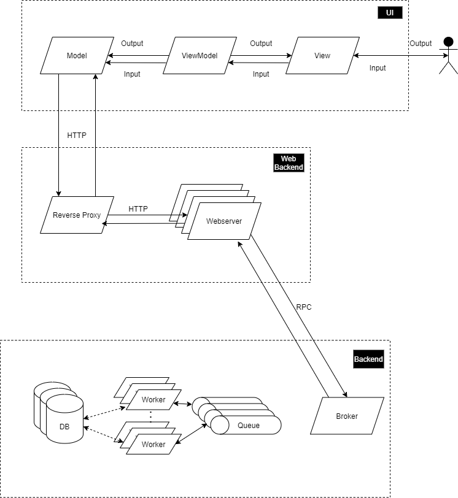

# Dev Documentation

## Getting Started

### Prerequesites

-   [Git](https://git-scm.com/downloads)
-   [Node.js & npm](https://nodejs.org/en/)
-   [Docker](https://docs.docker.com/get-docker/)
-   [Docker-Compose](https://docs.docker.com/compose/install/)

To start contributing clone the [project](https://github.com/plc-dev/aladin) to your local drive.

Once that is done, run `npm install` in every of the following directories:

-   backend
-   server
-   frontend

To then start a development environment simply run `docker-compose up` in the root directory and `npm run serve` in the frontend directory.

## Deployment

## Architecture && tech-stack

ALADIN is mainly written in [Typescript](https://www.typescriptlang.org/). The frontend additionally builds upon the [Vue Frontend Framework](https://vuejs.org/). Due to the use of a message broker in the backend any service could be written in any language, although the RPC-utility to communicate with [Rabbit-MQ](https://www.rabbitmq.com/) is only ensured for Typescript and is distributed as its own package via [npm](https://www.npmjs.com/package/rabbitmq-rpc-wrapper).

## Concepts

### Task Description Language (TDL)

#### UI

#### API

#### BE

## Frontend

### Canvas

### Store

### Task-Components

## WebServer

## Backend
